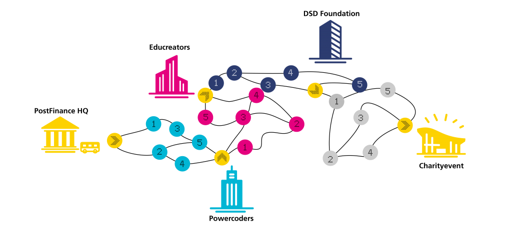
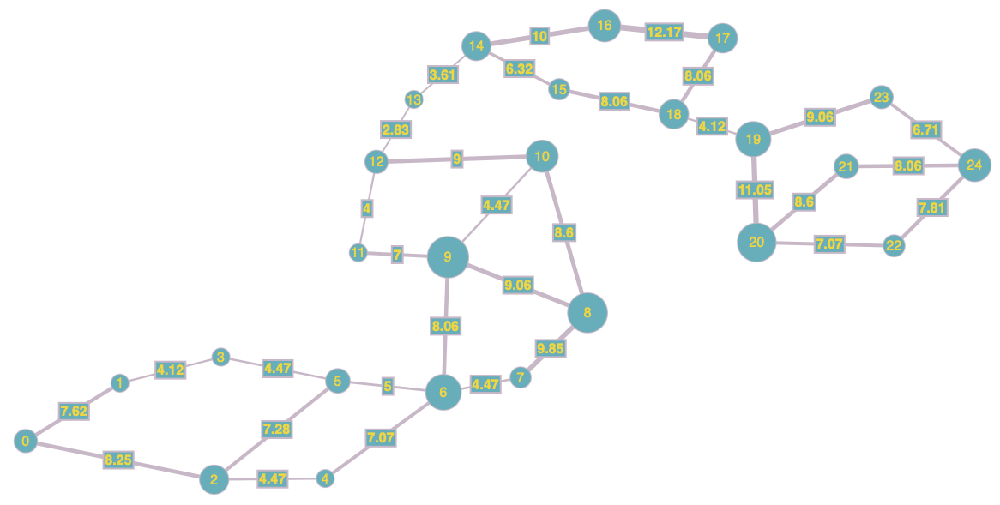

# PostFinance-Challenge

Tried to solve the PostFinance ["IT Challenge for Charity"](https://itchallengeforfuture.postfinance.ch).

First I thought that the shortest path from the start to the finish was asked. Therefore I implemented the Dijkstra algorithm. But unfortunately, my result was wrong.

So I looked for the shortest path which visits all nodes. With the Floyd-Warshall algorithm, all distances to all "activities" are calculated. After that, I compute the best path by calculating the distance for all permutations. To keep the number of permutations small I divided the graph into subgraphs.

Since none of my submissions are correct, I've written some tests. But still, I can not find my mistake.

**Node coordinates:**

**Setup:**

**My Graph**

